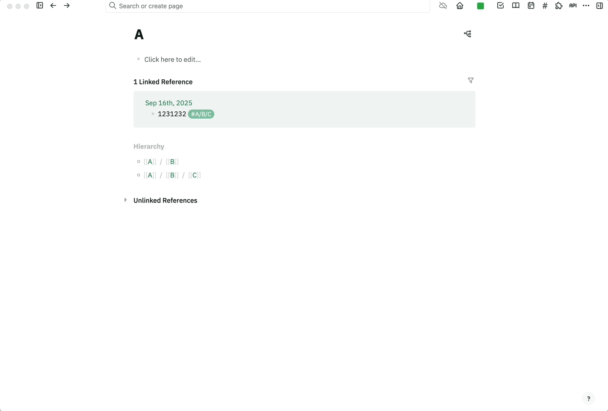
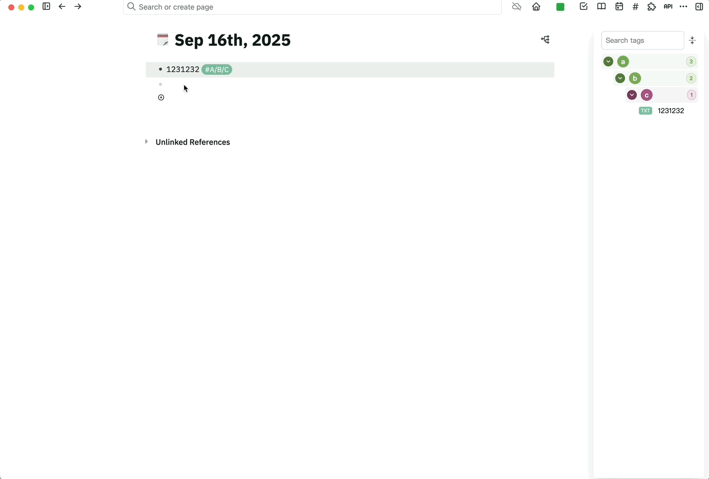

# Enhanced Tags Plugin for Logseq / 增强版标签插件

## 🎬 Demo / 演示

### Basic Usage / 基本使用

### Theme Settings / 主题设置  

### Advanced Features / 高级功能

---

## 📖 Description / 插件简介

**English:**
Enhanced Tags Plugin is an advanced tags management panel for Logseq that revolutionizes how you browse, search, and organize `#tags`. Built upon the excellent foundation of the original tags plugin, this enhanced version adds powerful new features including dual theme modes, native settings integration, improved UI consistency, and refined user experience.

**中文:**
增强版标签插件是一个功能强大的 Logseq 标签管理面板，彻底改变了您浏览、搜索和组织 `#标签` 的方式。在优秀的原版插件基础上，这个增强版本添加了双主题模式、原生设置集成、改进的UI一致性和精致的用户体验等强大新功能。

---

## ✨ Features / 功能特性

### 🎨 Dual Theme System / 双主题系统
- **Colorful Theme** / **彩色主题**: Vibrant colors with dynamic tag backgrounds
- **Simple Theme** / **简单主题**: Clean minimal design with monochrome styling
- Native Logseq settings integration / 原生Logseq设置集成

### 🔍 Enhanced Search & Navigation / 增强搜索导航
- Real-time tag filtering / 实时标签筛选
- Click tag names to open tag pages directly / 点击标签名直接打开标签页
- Smart expand/collapse state persistence / 智能展开/折叠状态持久化
- One-click expand/collapse all tags / 一键展开/折叠全部标签

### 🎯 Improved User Experience / 改进用户体验
- Consistent font sizes throughout the interface / 界面字体大小一致性
- Proper expand state visual indicators / 正确的展开状态视觉指示
- Fixed expand/collapse button functionality / 修复展开/折叠按钮功能
- Eliminated unnecessary "TXT" badges in simple theme / 简单主题下移除不必要的"TXT"标识

### ⚙️ Advanced Customization / 高级自定义
- Custom keyboard shortcuts / 自定义快捷键
- Drag-and-drop tag reordering with persistence / 拖拽排序并持久化
- Settings accessible via Logseq's native settings panel / 通过Logseq原生设置面板访问配置

### 🎪 Multi-level Tag Support / 多层级标签支持
- Hierarchical tag structure visualization / 层级标签结构可视化
- Proper background highlights for expanded states / 展开状态正确的背景高亮
- Clean content display (pages and text blocks) / 清洁的内容显示（页面和文字块）

---

## 🚀 Installation / 安装

### Option A: Logseq Marketplace (Recommended) / 选项A：Logseq市场（推荐）
1. Open Logseq → Settings → Plugins → Marketplace
2. Search for "Enhanced Tags" or "Tags Plugin"
3. Click Install

### Option B: Manual Installation / 选项B：手动安装
1. Download the latest release from [GitHub Releases](https://github.com/yourusername/logseq-plugin-tags/releases)
2. Unzip the downloaded file
3. In Logseq: Settings → Plugins → Load unpacked plugin
4. Select the unzipped folder

---

## 🎮 Usage / 使用方法

### Opening the Plugin / 打开插件
- **Toolbar**: Click the `#` button in the toolbar
- **Keyboard**: Use your custom shortcut (configurable in settings)

### Theme Configuration / 主题配置
1. Go to Settings → Plugins → Enhanced Tags Plugin → Settings
2. Choose between:
   - **Colorful Theme**: Dynamic colors with tag-specific backgrounds
   - **Simple Theme**: Minimal monochrome design
3. Set your preferred keyboard shortcut
4. Click Save

### Tag Management / 标签管理
- **Search**: Use the search box to filter tags in real-time
- **Navigate**: Click tag names to open their dedicated tag pages
- **Reorder**: Drag and drop tags to customize their order
- **Expand/Collapse**: Use the arrow button to toggle all tags at once
- **Individual Control**: Click individual arrows to expand specific tags

---

## ⚙️ Settings / 设置

Access settings via: **Logseq Settings → Plugins → Enhanced Tags Plugin → Settings**

### Available Options / 可用选项

#### Theme Style / 主题样式
- **Colorful Theme** / **彩色主题**: Multi-colored backgrounds with vibrant tag styling
- **Simple Theme** / **简单主题**: Clean monochrome design without decorative elements

#### Keyboard Shortcut / 快捷键
- Set a custom keyboard shortcut to quickly open the tags panel
- Examples: `mod+shift+t`, `alt+t`, `ctrl+shift+p`

---

## 🔧 Technical Improvements / 技术改进

### Fixed Issues / 已修复问题
- ✅ Keyboard shortcut conflicts resolved
- ✅ Consistent font sizing across all elements  
- ✅ Proper expand state visual feedback
- ✅ Fixed expand/collapse button toggle functionality
- ✅ Corrected multi-level tag background highlighting
- ✅ Removed unnecessary UI elements in simple theme

### Enhanced Features / 增强功能
- ✅ Native Logseq settings integration
- ✅ Dual theme system with instant switching
- ✅ Improved accessibility and user experience
- ✅ Better visual hierarchy and consistency

---

## 🤝 Contributing / 贡献

We welcome contributions! Please feel free to:
- Report bugs or suggest features via [GitHub Issues](https://github.com/yourusername/logseq-plugin-tags/issues)
- Submit pull requests for improvements
- Share your feedback and usage experiences

---

## 📄 License / 许可证

MIT License

---

## 🙏 Acknowledgements / 致谢

This enhanced version builds upon the excellent foundation of [gidongkwon/logseq-plugin-tags](https://github.com/gidongkwon/logseq-plugin-tags) (MIT License). Special thanks to the original author for creating such a useful plugin for the Logseq community.

本增强版本基于优秀的 [gidongkwon/logseq-plugin-tags](https://github.com/gidongkwon/logseq-plugin-tags) (MIT许可证) 开发。特别感谢原作者为Logseq社区创建了如此有用的插件。

---

## 📈 Changelog / 更新日志

### v2.0.0 (Latest) / v2.0.0 (最新)
- 🎨 Added dual theme system (Colorful + Simple)
- ⚙️ Integrated with Logseq native settings
- 🔧 Fixed expand state visual indicators
- 📝 Improved font consistency
- 🚫 Removed "TXT" badges in simple theme
- ⌨️ Enhanced keyboard shortcut management
- 🐛 Fixed multiple UI and functional issues

### Previous Versions / 历史版本
- Based on the original logseq-plugin-tags with enhancements for drag-and-drop, expand/collapse functionality, and improved UI consistency.

---

**Made with ❤️ for the Logseq Community**