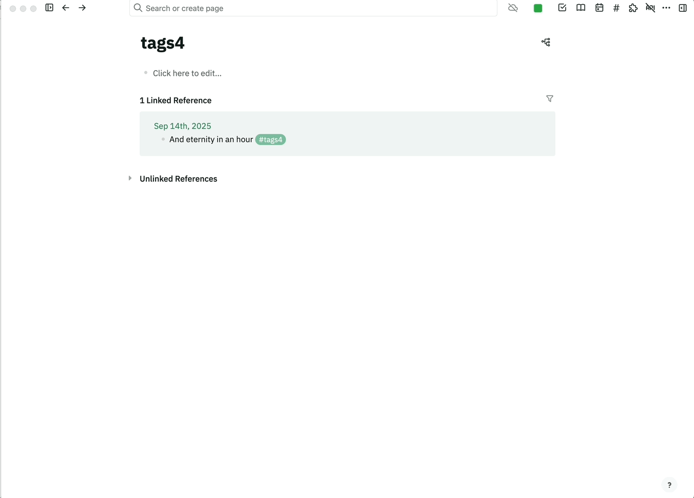
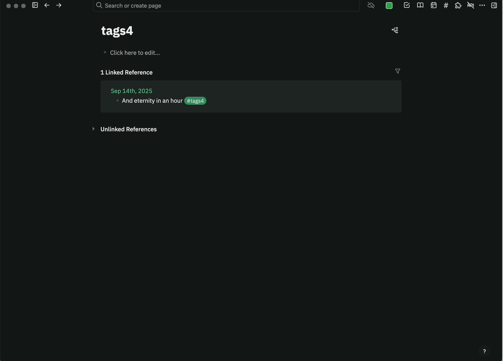

# New Tags for Logseq / 新Tags 插件

Based on / 基于: [gidongkwon/logseq-plugin-tags](https://github.com/gidongkwon/logseq-plugin-tags) 二次开发 / secondary development.

## Description / 插件简介

EN:
New Tags is a tags pane for Logseq that makes `#tags` easy to browse, search and manage. It supports drag-and-drop reordering with persistence, per-tag expand state persistence, and one-click expand/collapse all. Designed to match Logseq UI while providing efficient tag navigation.

ZH:
新Tags 是一个 Logseq 标签面板，方便浏览、搜索与管理 `#标签`。支持拖拽排序并持久化、单个标签展开状态持久化、以及一键“全部展开/全部折叠”。界面风格与 Logseq 一致，专注提升标签导航效率。

## Features / 功能特性

- Search tags with realtime filtering / 实时搜索标签
- Drag to reorder tags and persist order / 拖拽排序并持久化顺序
- Per-tag expand/collapse persisted / 每个标签展开/折叠状态持久化
- One icon button to toggle Expand all / Collapse all / 单个图标按钮切换“全部展开/全部折叠”
- NEW: Click tag name to open the tag page directly / 新功能：点击标签名可直接打开对应“标签页”（非普通页面跳转），一键进入标签聚合视图
- Fixed-height pane aligned with editor; internal scroll / 面板高度与编辑区一致，内部滚动
- Keyboard shortcut (user-defined) to open panel via Shortcuts page / 通过 Shortcuts 页面自定义快捷键打开面板（默认不绑定）

## Install / 安装

Option A: Marketplace (when approved) / 市场（审核通过后）

Option B: Manual / 手动安装
1. Download release zip and unzip / 下载压缩包并解压
2. Logseq → Settings → Plugins → Load unpacked plugin / Logseq → 设置 → 插件 → 加载未打包插件
3. Select the folder you unzipped / 选择解压后的文件夹

## Usage / 使用

- Open the pane: toolbar “#” or your custom shortcut / 打开面板：工具栏“#”或你自定义的快捷键
- Search box filters tags / 搜索框用于筛选标签
- Drag tag rows to reorder; order is saved / 拖拽标签行进行排序，顺序自动保存
- Click the top-right fold icon to expand or collapse all / 右上角折叠图标按钮用于一键展开/折叠全部
- Click a tag name to open its tag page directly / 点击标签名，直接打开该“标签页”，快速查看被该标签引用的页面与块

## License

MIT. Original work © [gidongkwon/logseq-plugin-tags](https://github.com/gidongkwon/logseq-plugin-tags). Enhancements © jlhulclq.

## Acknowledgements / 致谢

This project is derived from and inspired by
[gidongkwon/logseq-plugin-tags](https://github.com/gidongkwon/logseq-plugin-tags)
(MIT License). Thanks to the original author for the great work.
